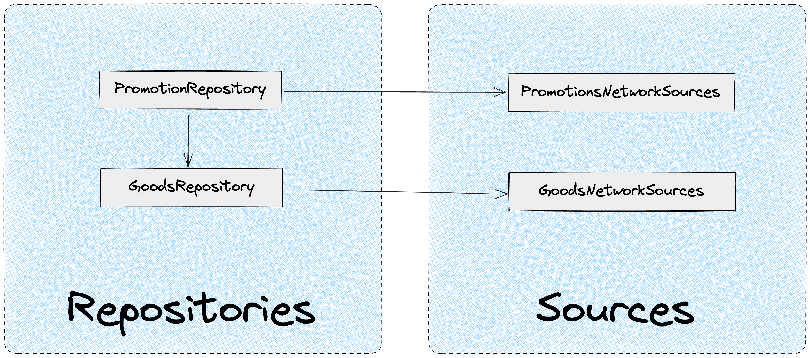

# Data

## Main Concept


The `Data` layer is responsible for working with data:

- Obtaining data from sources (server, localStorage…)
- Data aggregation and formatting
- Caching and cache modification
- Storing and distributing DTOs throughout the application

`Data` allows you to:

- Protect the application from API changes
- Decouple from data source and methods of data retrieval

`Data` contains two segments:

- `Repositories`. Facade providing data to the application.
- `Sources`. Services responsible for obtaining data from different sources. Sources can be auto-generated

```
├── app/
├── screens/
├── modules/
├── data/
|    ├── repositories/
|    ├── sources/
|    └── index.ts
└── shared/
```

## Protection from API Changes

`Data` allows protecting the application from API changes.

`Sources` directly depend on API and source, they are not available to the rest of the application.

The application only depends on `Repositories`, so when there are undesirable changes to the data interface on the API, changes will only affect `Repositories`, the rest of the application will remain unchanged.


**Example**

We receive tariff data from the server. `tariff-network-sources` is responsible for obtaining data from a specific source via REST.

`TariffRepository` in turn uses `tariff-network-sources` to get data and format it for the application.

At some point, the API changed the data format for tariffs. If we don't want to make changes to `Modules` that consume data, we can make changes at the `TariffRepository` level to adapt the new tariff data interface to what our application expects.

Result: changes were made only to `TariffRepository`, the rest of the system was not affected.

## Application Independence from Data Source

Thanks to `Data`, the application doesn't depend on the data source. If necessary, the data source and data retrieval method can be changed.

`Repositories` use `Sources` to get data. `Sources` depends on a specific data retrieval method (REST, GQL, WS…). The application in turn interacts only with `Repositories` and doesn't know where and how the data was obtained.

**Example**

`tariff-sources-network` can get data via REST, while `request-sources-network` can get data via GQL.

We need to get data about a request and the tariff selected in it. `RequestRepository` will provide our application with the `getRequestWithTariff` method, which will collect data from different sources and give it to the application.

Result: the application doesn't know by what method and from where the data was requested.

## Sources

`Sources` are services responsible for data retrieval. `Sources` depend on a specific data source.

`Sources` can be generated from OpenAPI or other available methods.

`Sources` don't contain any logic, they just fetch data from the required source.

**Example of data retrieval via REST**

```tsx
import { apiHttpClient } from '@shared'

import { TariffNetworkSourcesDTO } from './dto'

export const tariffsNetworkSources = {
  getTariffs: () => apiHttpClient.get<void, TariffNetworkSourcesDTO.TariffList>('/tariffs'),
}
```

`Sources` contain:

- Data retrieval service
- DTO

Example structure:

```
├── app/
├── screens/
├── modules/
├── data/
|    ├── repositories/
|    ├── sources/
|    |    ├── tariffs-network-sources/
|    |    |    ├── tariffs-network-sources.ts
|    |    |    ├── dto.ts
|    |    |    └── index.ts
|    |    └── index.ts
|    └── index.ts
└── shared/
```

**`Sources` are private services of the `Data` layer. `Sources` are not available in other layers. All data interaction in the application happens through `Repositories`.**

### Different Data Sources

`Sources` can get data from different sources, in different ways:

- REST
- GraphQL
- LocalStorage
- IndexDB
- Cookie
- File system
- …

### DTO

`Sources` contain data types that need to be sent to the server and data types that come in response.

All DTO types are located in the `dto.ts` file.

```
├── app/
├── screens/
├── modules/
├── data/
|    ├── repositories/
|    ├── sources/
|    |    ├── tariffs-network-sources/
|    |    |    ├── tariffs-network-sources.ts
|    |    |    ├── dto.ts
|    |    |    └── index.ts
|    |    └── index.ts
|    └── index.ts
└── shared/
```

## Repositories

`Repositories` are facades used in the application for working with data.

`Repositories:`

- Use `sources` to get data from different sources
- Format data for the application
- Aggregate data from different sources
- Cache data. Allow working with cache data (modify, invalidate…)

`Repositories` contains services for working with data.

Example structure:

```
├── app/
├── screens/
├── modules/
├── data/
|    ├── repositories/
|    |    ├── user-repository/
|    |    |    ├── user-repository.ts
|    |    |    ├── user-repository.test.ts
|    |    |    ├── dto.ts
|    |    |    ├── enums.ts
|    |    |    └── index.ts
|    |    ├── enums.ts
|    |    ├── types.ts
|    |    └── index.ts
|    ├── sources/
|    └── index.ts
└── shared/
```

### Splitting into Repositories

Each `Repository` is responsible for working with a specific data type.

**Example**

In the domain of an online store, we need to get data about:

- User
- Goods
- Promotions

For each data type, separate `Repositories` should be created:

```
├── app/
├── screens/
├── modules/
├── data/
|    ├── repositories/
|    |    ├── user-repository/
|    |    ├── goods-repository/
|    |    ├── promotions-repository/
|    |    └── index.ts
|    ├── sources/
|    └── index.ts
└── shared/
```

### Data Aggregation and Formatting

`Repositories` use `Sources` to get data.

One `Repository` can interact with multiple `sources`.

Also `Repository` can interact with each other to get data.

**Example**

We work in the domain of an online store.

In the `Promotion` module we need to display promotion data:

- Promotion name, description
- List of goods suitable for the promotion
  - Brief information about the good: name, cost, image

`promotion-network-sources` will allow getting promotion data, but it will contain only a list of goods IDs inside.

`GoodsRepository` provides a method for getting and caching goods data. Uses `goods-network-sources` to get data.

`PromotionRepository` will provide a method that will get data from `promotion-network-sources` and `GoodsRepository`, then combine them and format them as convenient for our application.



### Working with Cache

Cache work should happen at the `Repositories` level.

`Repositories` should hide cache implementation and provide the application with abstract methods for working with data.

Example `UserRepository` using mobx-tanstack-query for caching:

```tsx
import { CacheService } from '@shared'

import { UserNetworkSources } from '../../sources'

export class UserRepository {
  private readonly keys = {
    contactInfoCacheKey: 'contact-info-cache-key'
  }

  constructor(
    private readonly userNetworkSources: UserNetworkSources,
    private readonly cache: CacheService,
  ) {}

  public getContactInfoQuery = () =>
    this.cache.createQuery<UserRepositoryDTO.UserContactDTO>(
      async () => {
        const { data } = this.userNetworkSources.getContactInfo()
        return data
      },
      {
        queryKey: [this.keys.contactInfoCacheKey]
      }
    )
}
```

### DTO

`Repositories` contain DTOs used in the application.

```
├── app/
├── screens/
├── modules/
├── data/
|    ├── repositories/
|    |    ├── user-repository/
|    |    |    ├── user-repository.ts
|    |    |    ├── user-repository.test.ts
|    |    |    ├── dto.ts
|    |    |    ├── enums.ts
|    |    |    └── index.ts
|    |    └── index.ts
|    ├── sources/
|    └── index.ts
└── shared/
```

`Repository` uses types from `sources` to form its DTOs.

A scenario of simple DTO re-export from `sources` is possible, this is acceptable and necessary so that at any moment the data format in `Repository` can be changed.

`data/repositories/user-repository/dto.ts`

```tsx
import { UserNetworkSourcesDTO, TariffNetworkSourcesDTO } from '../../sources';

export type User = UserNetworkSourcesDTO.User & UserNetworkSourcesDTO.Permissions;

export type EditUserInfoInput = UserNetworkSourcesDTO.EditUserInfoInput;
data.
export type TariffList = TariffNetworkSourcesDTO.TariffList;
```

`data/repositories/user-repository/index.ts`

```tsx
export * as UserRepositoryDTO from './dto'
```

#### Enums

`Repositories` DTOs can contain `enums`. `Enums` should be created or re-exported through `enums.ts` in a specific `Repository`.

`data/repositories/user-repository/enums.ts`

```tsx
export { UserPermission } from '../sources'

export enum UserStatus {
  active,
  inactive,
}
```

### Proxy Requests

In `Repositories`, proxy requests to `sources` are quite often used:

`dto.ts`

```tsx
import { TariffNetworkSourcesDTO } from '../../sources'

export type Tariff = TariffNetworkSourcesDTO.Tariff

export type TariffList = TariffNetworkSourcesDTO.TariffList
```

`index.ts`

```tsx
export * as TariffRepositoryDTO from './dto'
```

`TariffRepository.ts`

```tsx
export class TariffRepository {
  constructor(private readonly tariffNetworkSources: TariffsNetworkSources) {
    this.tariffNetworkSources = tariffNetworkSources
  }

  public getTariffs = async () => this.tariffNetworkSources.getTariffs()
}
```

This phenomenon is normal because it allows our application not to depend on `sources` and API.

If necessary, we can change the data source or data format at the `Repository` level.

### DI for Repositories

All `Repository` dependencies should be inverted. It's recommended to use simple DI without IoC.

```tsx
import { CacheService } from '@shared'

import { UserNetworkSources } from '../../sources'

class UserRepository {
  private readonly keys = {
    userInfo: 'user-info',
  }

  constructor(
    private readonly userNetworkSources: UserNetworkSources,
    private readonly cache: CacheService,
  ) {}

  public getUserInfoQuery = () =>
    this.cache.createQuery(
      async () => {
        const { data } = await this.userNetworkSources.getPersonInfo()
        return data
      },
      {
        queryKey: [this.keys.userInfo],
      },
    )

  public invalidateUserInfo = () => {
    this.cache.invalidate([this.keys.userInfo])
  }
}
```

`Repository` should control dependencies through constructor. All external dependencies are described in the constructor.

Benefits of using DI:

- Dependency control. You can immediately see what the `Repository` depends on
- Testing simplicity. Dependency can be substituted with a mock for testing
- Low coupling. `Repositories` depend on abstract interfaces, not concrete implementations

---

## Reusing enums and types

Between `Repositories` and `Sources` you can reuse enums and types:

[Reusable types, enums | Style Guide]("../style-guides/en/architecture/data/common.md")

---

## Data Layer Style Guide

[Data | Style Guide]("../style-guides/en/architecture/data")

---

## Testing

### Only `Repositories` are covered by tests

Since `Sources` are private services of the `data` layer that don't contain logic, there's no need to test them.

**Only `Repositories` need to be tested.**

### Test Implementation Rules

When implementing tests **`Repositories` must follow unified rules:**

[Unit tests | Style Guide]("../style-guides/en/testing")

### Faker for `Sources`

Next to `Sources` should be its `faker`, which will allow generating data for stubs:

```
├── app/
├── screens/
├── modules/
├── data/
|    ├── repositories/
|    ├── sources/
|    |    ├── cart-network-sources/
|    |    |    ├── cart-network-sources.ts
|    |    |    ├── dto.ts
|    |    |    ├── faker.ts
|    |    |    └── index.ts
|    |    └── index.ts
|    └── index.ts
└── shared/
```

Example `faker`:

```tsx
export const cartNetworkSourcesFaker = {
  makeGoodsList(length: number = 10): CartNetworkSourcesDTO.GoodsList {
    return {
      data: Array.from({ length }).map(() => this.makeGoodsItem()),
    }
  },
  makeGoodsItem(
    data?: Partial<CartNetworkSourcesDTO.GoodsItem>,
  ): CartNetworkSourcesDTO.CartGoodsItemDTO {
    return {
      name: faker.commerce.productName(),
      id: faker.string.uuid(),
      price: faker.number.int(100000),
      count: faker.number.int(5),
      ...data,
    }
  },
}
```

### Substituting `Sources` when testing `Repositories`

For testing **`Repositories`** all `Sources` must be substituted with stubs.

At the same time, corresponding `faker` are used to generate stub data for `Sources`.

Example:

```tsx
class BookRepository {
  private readonly keys = {
    genre: (id: string) => ['genre', id] as const,
    bookByName: (name: string) => ['book-by-name', name] as const,
    bookList: 'book-list',
  }

  constructor(
    private readonly bookNetworkSources: BookNetworkSources,
    private readonly cache: CacheService,
  ) {}

  public getGenreByIDQuery = (id: string) =>
    this.cache.createQuery<BookRepositoryDTO.Genre>(
      async () => {
        const { data } = await this.bookNetworkSources.getGenreByID(id)
        return data
      },
      {
        queryKey: this.keys.genre(id),
      },
    )

  public getBookByNameQuery = (name: string) =>
    this.cache.createQuery<BookRepositoryDTO.BookByName, ApiDataError>(
      async () => {
        const { data } = await this.bookNetworkSources.getBookByName({
          name,
        })

        const { genreID, ...book } = data

        const genreQuery = this.getGenreByIDQuery(genreID)
        const genre = await genreQuery.result

        return { ...book, genre }
      },
      {
        queryKey: this.keys.bookByName(name),
      },
    )

  public createBookMutation = () =>
    this.cache.createMutation(
      async (newBook: BookRepositoryDTO.NewBook) => {
        const { data } = await this.bookNetworkSources.createBook(newBook)
        return data
      },
      {
        onSuccess: () => {
          this.cache.invalidate([this.keys.bookList])
        },
      },
    )
}
```

```tsx
describe('BookRepository', () => {
  it('Book request by author forms detailed author information', async () => {
    const fakeGenre = bookNetworkSourcesFaker.makeGenre()
    const fakeBook = bookNetworkSourcesFaker.makeBookByName()

    const bookSourcesMock = mock<BookNetworkSources>({
      getBookByName: async () => makeFakeSourceRes(fakeBook),
      getGenreByID: async () => makeFakeSourceRes(fakeGenre),
    })
    const sut = new BookRepository(bookSourcesMock, createCacheService())

    const bookByNameQuery = sut.getBookByNameQuery(fakeBook.name)

    const { genre } = await bookByNameQuery.async()

    expect(genre).toEqual(fakeGenre)
  })
})
```

### Testing public `Repository` methods

In `Repository` it's necessary to test only public methods containing at least some significant logic.

In the example below, it's necessary to test only the `getBookByNameQuery` method because the rest of the methods contain primitive logic, testing which won't increase system reliability.

```tsx
class BookRepository {
  private readonly keys = {
    genre: (id: string) => ['genre', id] as const,
    genreList: 'genre-list',
    bookByName: (name: string) => ['book-by-name', name] as const,
    bookList: 'book-list',
  }

  constructor(
    private readonly bookNetworkSources: BookNetworkSources,
    private readonly cache: CacheService,
  ) {}

  public getGenreByIDQuery = (id: string) =>
    this.cache.createQuery<BookRepositoryDTO.Genre>(
      async () => {
        const { data } = await this.bookNetworkSources.getGenreByID(id)
        return data
      },
      {
        queryKey: this.keys.genre(id),
      },
    )

  public getGenreListQuery = () =>
    this.cache.createQuery<BookRepositoryDTO.GenreList>(
      async () => {
        const { data } = await this.bookNetworkSources.getGenreList()
        return data
      },
      {
        queryKey: [this.keys.genreList],
      },
    )

  public getBookByNameQuery = (name: string) =>
    this.cache.createQuery<BookRepositoryDTO.BookByName, ApiDataError>(
      async () => {
        const { data } = await this.bookNetworkSources.getBookByName({
          name,
        })

        const { genreID, ...book } = data

        const genreQuery = this.getGenreByIDQuery(genreID)
        const genre = await genreQuery.result

        return { ...book, genre }
      },
      {
        queryKey: this.keys.bookByName(name),
      },
    )

  public createBookMutation = () =>
    this.cache.createMutation(
      async (newBook: BookRepositoryDTO.NewBook) => {
        const { data } = await this.bookNetworkSources.createBook(newBook)
        return data
      },
      {
        onSuccess: () => {
          this.cache.invalidate([this.keys.bookList])
        },
      },
    )

  public updateBookMutation = () =>
    this.cache.createMutation(
      async (updatedBook: BookRepositoryDTO.UpdatedBook) => {
        const { data } = await this.bookNetworkSources.updateBook(updatedBook)
        return data
      },
      {
        onSuccess: (updatedBook) => {
          this.cache.invalidate([this.keys.bookList])
          this.cache.invalidate([this.keys.bookByName(updatedBook.name)])
        },
      },
    )
}
```

---

### Testing SUT that use Repositories

In other application layers, only `Repositories` are available for working with data.

#### Substituting `Repositories` when testing SUT

When testing SUT, `Repositories` must be substituted with mocks or stubs.

Using real instances of `Repositories` in which `Sources` are substituted is not acceptable because it reveals `Repositories` implementation details and leads to increased test fragility.

**Example**

```tsx
class GoodsListStore {
  constructor(private readonly bookRepository: BookRepository) {
    makeAutoObservable(this)
  }

  private get listQuery() {
    return this.bookRepository.getBookListQuery()
  }

  public get list(): ListItem[] {
    const data = this.listQuery.data?.data || []

    return data.map(({ id, name, price }) => ({
      id,
      name,
      price: formatPriceToView(price),
      store: createProductCartManagerStore(id),
    }))
  }
}
```

Invalid

```tsx
describe('GoodsListStore', () => {
  it('Books list is formatted for display', async () => {
    const cacheService = createCacheService()
    const fakeBookList = bookNetworkSourcesFaker.makeBookList()
    const fakeBookListItem = fakeBookList.data[0]

    const bookSourcesMock = mock<BookNetworkSources>({
      getBookByName: async () => makeFakeSourceRes(fakeBookList),
    })

    const bookRepository = new BookRepository(bookSourcesMock, cacheService)

    const sut = new GoodsListStore(bookRepository)

    // wait for automatic data loading
    await when(() => Boolean(sut.list?.length))

    expect(sut.list[0]).toContain({
      id: fakeBookListItem.id,
      name: fakeBookListItem.name,
      price: '1 000 rub.',
    })
  })
})
```

Valid

```tsx
describe('GoodsListStore', () => {
  it('Books list is formatted for display', async () => {
    const cacheService = createCacheService()
    const fakeBookList = bookRepositoryFaker.makeBookList(2, { price: 1000 })
    const fakeBookListItem = fakeBookList.data[0]

    const bookRepositoryMock = mock<BookRepository>({
      getBookListQuery: () =>
        this.cache.createQuery(['id'], async () => fakeBookList, {
          queryKey: ['id'],
        }),
    })
    const sut = new GoodsListStore(bookRepositoryMock)

    // wait for automatic data loading
    await when(() => Boolean(sut.list?.length))

    expect(sut.list[0]).toContain({
      id: fakeBookListItem.id,
      name: fakeBookListItem.name,
      price: '1 000 rub.',
    })
  })
})
```

---

#### Faker for Repositories

For each `Repository` its own `faker` should be created.

#### **Faker placement**

`Faker` is located directly next to the `Repository`:

```
├── app/
├── screens/
├── modules/
├── data/
|    ├── repositories/
|    |    ├── cart-repository/
|    |    |    ├── cart-repository.ts
|    |    |    ├── dto.ts
|    |    |    ├── faker.ts
|    |    |    └── index.ts
|    |    └── index.ts
|    ├── sources/
|    |    ├── cart-network-sources/
|    |    |    ├── cart-network-sources.ts
|    |    |    ├── dto.ts
|    |    |    ├── faker.ts
|    |    |    └── index.ts
|    |    └── index.ts
|    └── index.ts
└── shared/
```

#### **Reusing `sources` fakes**

`Repository` `Faker` can use `sources` `faker`s to generate data:

```tsx
export const bookRepositoryFaker = {
  makeBookList(
    length?: number,
    item?: Partial<BookRepositoryDTO.BookListItem>,
  ): BookRepositoryDTO.BookListDTO {
    return bookNetworkSourcesFaker.makeBookList(length, item)
  },
  makeBookByName(): BookRepositoryDTO.BookByName {
    return {
      ...bookNetworkSourcesFaker.makeBookByName(),
      genre: bookNetworkSourcesFaker.makeGenre(),
    }
  },
}
```

Faker sources are not available outside the `data` layer.

#### **Using faker for Repository mocks**

When testing entities located in layers other than `data`, `mock` must be used for `repositories`.

`Mock` must be created based on interfaces, not implementation:

[Creating mocks and stubs](/unit-testing/mock-and-stub.md)

**Example of `repository` substitution using `faker`:**

```tsx
describe('GoodsListStore', () => {
  it('Books list is formatted for display', async () => {
    const cacheService = createCacheService()
    const fakeBookList = bookRepositoryFaker.makeBookList(2, { price: 1000 })
    const fakeBookListItem = fakeBookList.data[0]

    const bookRepositoryMock = mock<BookRepository>({
      getBookListQuery: () =>
        this.cache.createQuery(['id'], async () => fakeBookList, {
          queryKey: ['id'],
        }),
    })
    const sut = new GoodsListStore(bookRepositoryMock)

    // wait for automatic data loading
    await when(() => Boolean(sut.list?.length))

    expect(sut.list[0]).toContain({
      id: fakeBookListItem.id,
      name: fakeBookListItem.name,
      price: '1 000 rub.',
    })
  })
})
```

---

#### Testing SUT interaction with Repository

If a test should check the correctness of data passed to `repository`, then the check should be performed on the boundary of `repository` and SUT interaction - checking the call on mock `repository`:

```tsx
class CardPaymentStore {
  constructor(
    private readonly cartStore: CartStore,
    private readonly paymentRepository: PaymentRepository,
  ) {
    makeAutoObservable(this)
  }

  private get paymentMutation() {
    return this.paymentRepository.createPaymentByCardMutation()
  }

  public pay = (params?: { onSuccess: () => void }) => {
    const { onSuccess } = params || {}
    const goodsId = this.cartStore.goods.map(({ id }) => id)

    this.paymentMutation.sync({
      params: goodsId,
      onSuccess,
    })
  }
}
```

```tsx
describe('CardPaymentStore', () => {
  it('All goods from cart are sent for payment', () => {
    const fakeGoodsList = cartRepositoryFaker.makeGoodsList(2)

    const mutationMock
      = mock<ReturnType<PaymentRepository['createPaymentByCardMutation']>>()

    const cartStoreMock = mock<CartStore>({
      goods: fakeGoodsList,
    })
    const paymentRepositoryMock = mock<PaymentRepository>({
      createPaymentByCardMutation: () => mutationMock,
    })
    const sut = new CardPaymentStore(cartStoreMock, paymentRepositoryMock)

    sut.pay()

    expect(mutationMock.sync.mock.lastCall?.[0]?.params).toEqual([
      fakeGoodsList[0].id,
      fakeGoodsList[1].id,
    ])
  })
})
```

---

## Contract First Approach

In order to develop frontend and backend parts in parallel, the Contract First approach is used: the backend forms interfaces in advance through which the client application will interact with the API.

The architectural approach provides a tool for convenient development using the Contract First approach.

### Fake sources

For each `sources` its own fake version can be created in the `faker` file:

```
├── app/
├── screens/
├── modules/
├── data/
|    ├── repositories/
|    ├── sources/
|    |    ├── cart-network-sources/
|    |    |    ├── cart-network-sources.ts
|    |    |    ├── dto.ts
|    |    |    ├── faker.ts
|    |    |    └── index.ts
|    |    └── index.ts
|    └── index.ts
└── shared/
```

`data/sources/cart-network-sources/faker.ts`

```tsx
export const fakeCartNetworkSources: CartNetworkSources = {
  ...cartNetworkSources,
  getGoods: async () =>
    makeFakeSourceRes(cartNetworkSourcesFaker.makeGoodsList()),
  getGoodsCount: async () => makeFakeSourceRes(10),
}
```

Thanks to using DI for `repositories`, real `sources` are substituted with fake ones:

```tsx
export const cartRepository = new CartRepository(
  fakeCartNetworkSources,
  cacheService,
)
```

Now the developer can implement a new feature using the Contract First approach, with the entire system, except sources, working the same as in production.

After successful API implementation, we simply change fake sources to real ones:

```tsx
export const cartRepository = new CartRepository(
  cartNetworkSources,
  cacheService,
)
```

### Advantages of using fake sources

- Data substitution happens at the very edge of the architecture - sources. Thanks to this, the entire system, except for `sources`, works identically to production.
- No need to independently come up with test data
- Thanks to fake data generation, the probability of catching a bug at an early stage of development increases (for example, overflow errors in markup)
