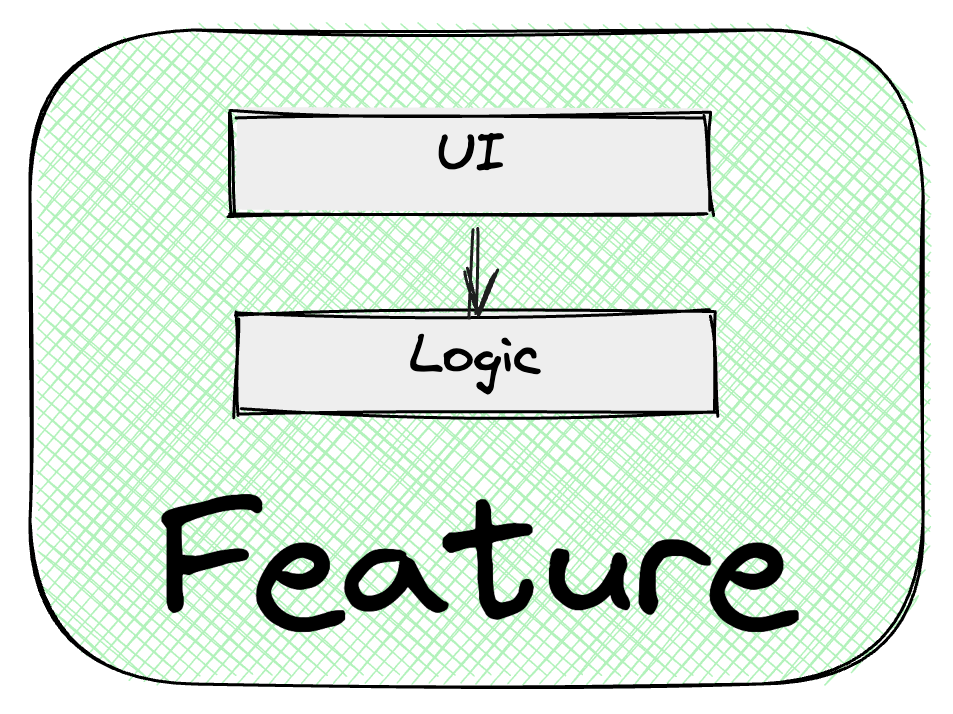

# Separating Logic from View

The UI component should be responsible **only for rendering,** the amount of UI logic in the component should be reduced to zero.

All logic is implemented outside the component in [`UIStore`](./ui-store.en.md) or [`useLogic`](./use-logic.en.md).



## Motivation

Separating the view layer from logic provides the following advantages:

- Ability to change logic and UI independently
- Simplicity of reusing logic or UI when necessary
- Independence from the used framework. The framework can be replaced under certain circumstances, and the logic can be reused
- Testing simplicity. Ability to test logic and UI separately
- Unambiguous location of logic. All logic is always in one place
- Logic doesn't "spread" across components. Eliminates code maintenance difficulties
- Improved code readability
- Simplified application maintenance

## UI Component

A component should contain only what is directly related to the framework responsible for rendering.

### ❌ Component should not contain

All the functions listed below should be in [`UIStore`](./ui-store.en.md) or [`useLogic`](./use-logic.en.md).

#### Data formatting logic for display

##### Formatting dates for display

###### ❌ Invalid
```tsx
export function Card({ date }: Props) {
  return (
    <Wrapper>
      <IssueDate>{date.toLocaleDateString()}</IssueDate>
    </Wrapper>
  )
}
```

###### ✅ Valid
```tsx
import { useLocalObservable } from 'mobx-react-lite'

import { createUIStore } from './ui-store'

export function Card(props: Props) {
  const { issueDate } = useLocalObservable(() => createUIStore(props))

  return (
    <Wrapper>
      <IssueDate>{issueDate}</IssueDate>
    </Wrapper>
  )
}
```

---

##### String concatenation for display

###### ❌ Invalid
```tsx
export function Card({ name, surname }: Props) {
  return (
    <Wrapper>
      <Typography>{`${name} ${surname}`}</Typography>
    </Wrapper>
  )
}
```

###### ✅ Valid
```tsx
import { useLocalObservable } from 'mobx-react-lite'

import { createUIStore } from './ui-store'

export function Card(props: Props) {
  const { fullName } = useLocalObservable(() => createUIStore(props))

  return (
    <Wrapper>
      <Typography>{fullName}</Typography>
    </Wrapper>
  )
}
```

---

#### Forming arrays or objects

##### ❌ Invalid
```tsx
export function List({ list }: Props) {
  const data = useMemo(
    () => list.map(({ name, surname }) => `${name} ${surname}`),
    [list],
  )

  return (
    <Wrapper>
      {data.map(fullName => (
        <li key={fullName}>
          <Typography>{fullName}</Typography>
        </li>
      ))}
    </Wrapper>
  )
}
```

###### ✅ Valid
```tsx
import { useLocalObservable } from 'mobx-react-lite'

import { createUIStore } from './ui-store'

export function List({ list }: Props) {
  const { data, updateList } = useLocalObservable(() => createUIStore(list))

  useEffect(() => {
    updateList(list)
  }, [list])

  return (
    <Wrapper>
      {data.map(fullName => (
        <li key={fullName}>
          <Typography>{fullName}</Typography>
        </li>
      ))}
    </Wrapper>
  )
}
```

---

#### Formatting props for components

##### ❌ Invalid
```tsx
import { useLocalObservable } from 'mobx-react-lite'

import { createUIStore } from './ui-store'

export function Card() {
  const { name, list } = useLocalObservable(createUIStore)

  return (
    <Wrapper>
      <Viewer
        title={`Detailed information about ${name}`}
        descriptions={list.map(({ description }) => description)}
      />
    </Wrapper>
  )
}
```

##### ✅ Valid
```tsx
import { useLocalObservable } from 'mobx-react-lite'

import { createUIStore } from './ui-store'

export function Card() {
  const { viewerTitle, descriptions } = useLocalObservable(createUIStore)

  return (
    <Wrapper>
      <Viewer
        title={viewerTitle}
        descriptions={descriptions}
      />
    </Wrapper>
  )
}
```

#### Calculating flags responsible for displaying UI parts

##### ❌ Invalid
```tsx
export function Card({ name, isOwner }: Props) {
  const isShowTitle = Boolean(name) && isOwner

  return <Wrapper>{isShowTitle && <Title>Title</Title>}</Wrapper>
}
```

##### ✅ Valid
```tsx
import { useLocalObservable } from 'mobx-react-lite'

import { createUIStore } from './ui-store'

export function Card({ name, isOwner }: Props) {
  const { isShowTitle } = useLocalObservable(() => createUIStore({ name, isOwner }))

  return <Wrapper>{isShowTitle && <Title>Title</Title>}</Wrapper>
}
```

### ✅ Component may contain

ℹ️ All the functions listed below can be in either the component or in `useLogic`, if `useLogic` is defined.

#### Getting ref and passing HTMLElement to logic for subsequent processing

Example:
```tsx
import { useLocalObservable } from 'mobx-react-lite'

import { createUIStore } from './ui-store'

export function Card() {
  const { setContainer } = useLocalObservable(createUIStore)

  const containerRef = useRef()

  useEffect(() => {
    setContainer(containerRef.current)
  }, [])

  return (
    <Wrapper ref={containerRef}>
      ...
    </Wrapper>
  )
}
```

#### Binding logic to component lifecycle methods

Example:
```tsx
import { useLocalObservable } from 'mobx-react-lite'

import { createUIStore } from './ui-store'

export function Card() {
  const { mount, unmount } = useLocalObservable(createUIStore)

  useEffect(() => {
    mount()

    return unmount
  }, [])

  return <Wrapper>...</Wrapper>
}
```

#### Defining event handlers

Example:
```tsx
import { useLocalObservable } from 'mobx-react-lite'

import { createUIStore } from './ui-store'

export function Input() {
  const { value, changeValue } = useLocalObservable(createUIStore)

  const handleChange = (event: ChangeEvent<HTMLInputElement>) => {
    changeValue(event.target.value)
  }

  return <input type="text" onChange={handleChange} value={value} />
}
```

Note: SyntheticEvent are part of React, so event penetration into the logic layer is undesirable.

#### Defining render functions

Example:
```tsx
import { useLocalObservable } from 'mobx-react-lite'

import { createUIStore } from './ui-store'

export function Status() {
  const { statusType, info } = useLocalObservable(createUIStore)

  const renderStatus = () => {
    switch (statusType) {
      case StatusType.Success:
        return <SuccessStatus />
      case StatusType.Error:
        return <ErrorStatus />
      default:
        return <Info data={info} />
    }
  }

  return <Wrapper>{renderStatus()}</Wrapper>
}
```

**The UI component consumes feature logic and completely depends on its interfaces.**

## Logic

Within `features`, business logic and UI logic are not separated.

Logic in `feature` contains:

- Forming data for display in UI
- Working with data, interacting with `Data` layer
- Working with flags that will be responsible for component display in the component (for example, removal from DOM, color change, etc.)

**Feature logic should not depend on the UI component**. **Dependencies are directed from UI to logic:**


Logic can be implemented on any preferred stack using:

- state manager
- hook (React stack)
- service
- utils

### Motivation for combining business and UI logic in feature

- If you leave UI logic in the component, there's a high probability of business logic leaking into the component
- In a real project, it's often quite difficult to decide what belongs to business logic and what belongs to UI. Situations arise when developers slow down in feature implementation due to the dilemma: where to place this logic? In the component or in the store?

### UI Logic Implementation

For logic implementation, it's recommended to use state manager in [UIStore](./ui-store.en.md).

State manager will allow:

- Not depending on UI framework specifics
- Avoiding unwanted dependencies on UI. It's technically impossible to place UI framework specifics in state manager
- Writing simple tests for logic

Using react hooks is acceptable for logic implementation in [useLogic](./use-logic.en.md), but it's desirable to avoid this scenario.
Since hooks are part of react, all UI methods are available in them, which means framework specifics will penetrate into logic.

This can lead to problems:

- Inability to reuse logic in another stack
- Mixing UI and logic. Without control, logic for working with ref, react events, etc. will get into hooks
- Inability to reuse logic due to indirect dependency on UI
- Difficulty working with global data
- Testing complexity. Testing hooks requires additional tools (react-testing-library, jsdom | happydom)
