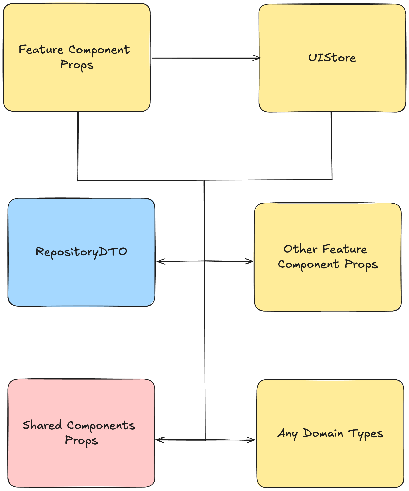

# UIStore

`UIStore` - is feature logic implemented using state manager.

`UIStore` can be considered as **View-Model** from **MVVM** pattern or [Supervising Controller](https://www.martinfowler.com/eaaDev/SupervisingPresenter.html).

It's recommended to prefer logic implementation through `UIStore` over `useLogic`. Reasons:

- Ability to simplify reactive logic by using state manager
- Simpler tests for logic
- Less coupling with UI framework specifics

## Structure

```
├── app/
├── screens/
├── modules/
|    └── payment/
|    |    ├── features/
|    |    |    ├── payment-switch/
|    |    |    |    ├── payment-switch.tsx
|    |    |    |    ├── ui-store/
|    |    |    |    |    ├── ui-store.ts
|    |    |    |    |    └── index.ts
|    |    |    |    └── index.ts
|    |    |    ├── cash-payment/
|    |    |    └── index.ts
|    |    ├── domain/
|    |    └── index.ts
├── data/
└── shared/
```

## Style guide

[Style guide | UIStore](\"../../../style-guides/en/architecture/modules/features/ui-store.md\")

## Working with data layer

`UIStore` interacts with `data` layer for:

- Getting data
- Formatting data for display in component
- Forming data loading state flags for display in component

## Forming data for display

### Formatting dates for display

```tsx
export class UIStore {
  constructor(private readonly params: { issueDate: Date }) {
    makeAutoObservable(this)
  }

  public get issueDate() {
    return this.params.issueDate.toLocaleDateString()
  }
}
```

```tsx
import { useLocalObservable } from 'mobx-react-lite'

import { createUIStore } from './ui-store'

export function Card(props: Props) {
  const { issueDate } = useLocalObservable(() => createUIStore(props))

  return (
    <Wrapper>
      <IssueDate>{issueDate}</IssueDate>
    </Wrapper>
  )
}
```

---

### String concatenation for display

```ts
export class UIStore {
  constructor(private readonly params: { name: string, surname: string }) {
    makeAutoObservable(this)
  }

  public get fullName() {
    return `${this.params.name} ${this.params.surname}`
  }
}
```

```tsx
import { useLocalObservable } from 'mobx-react-lite'

import { createUIStore } from './ui-store'

export function Card(props: Props) {
  const { fullName } = useLocalObservable(() => createUIStore(props))

  return (
    <Wrapper>
      <Typography>{fullName}</Typography>
    </Wrapper>
  )
}
```

---

### Forming arrays or objects

```ts
export class UIStore {
  constructor(
    private readonly params: { list: Array<{ name: string, surname: string }> },
  ) {
    makeAutoObservable(this)
  }

  public get data() {
    return this.params.list.map(({ name, surname }) => `${name} ${surname}`)
  }
}
```

```tsx
import { useLocalObservable } from 'mobx-react-lite'

import { createUIStore } from './ui-store'

export function List(props: Props) {
  const { data } = useLocalObservable(() => createUIStore(props))

  return (
    <Wrapper>
      {data.map(fullName => (
        <li key={fullName}>
          <Typography>{fullName}</Typography>
        </li>
      ))}
    </Wrapper>
  )
}
```

---

### Calculating flags responsible for displaying UI parts

```ts
export class UIStore {
  constructor(private readonly params: { name?: string, isOwner: boolean }) {
    makeAutoObservable(this)
  }

  public get isShowTitle() {
    return Boolean(this.params.name) && this.params.isOwner
  }
}
```

```tsx
import { useLocalObservable } from 'mobx-react-lite'

import { createUIStore } from './ui-store'

export function Card({ name, isOwner }: Props) {
  const { isShowTitle } = useLocalObservable(() => createUIStore({ name, isOwner }))

  return <Wrapper>{isShowTitle && <Title>Title</Title>}</Wrapper>
}
```

---

### Formatting props for components

```ts
export class UIStore {
  constructor(private readonly userStore: UserStore) {
    makeAutoObservable(this)
  }

  public get viewerTitle() {
    const { name } = this.userStore

    return `Detailed information about ${name}`
  }

  public get descriptions() {
    return this.userStore.descriptions.map(({ text }) => text)
  }
}
```

```tsx
import { useLocalObservable } from 'mobx-react-lite'

import { createUIStore } from './ui-store'

export function Card() {
  const { viewerTitle, descriptions } = useLocalObservable(createUIStore)

  return (
    <Wrapper>
      <Viewer
        title={viewerTitle}
        descriptions={descriptions}
      />
    </Wrapper>
  )
}
```

## UIStore should not depend on current feature component props

If `UIStore` depends on current feature component props, circular dependencies will arise.

`UIStore` types can depend on:

- Props of other feature components
- Props of shared components
- Domain of any modules
- Data layer



[About forming props for feature component](./props.en.md).

## Tracking component props changes

Often in `UIStore` it's necessary to track changes in current feature props.
For this, it's necessary to precisely subscribe to specific props changes in the component through `useEffect` and pass them to `UIStore`:

```tsx
import { useLocalObservable } from 'mobx-react-lite'

import { createUIStore } from './ui-store'

function FullName({ name, surname }: Props) {
  const { fullName, updateUserInfo } = useLocalObservable(() =>
    createUIStore({ name, surname }),
  )

  useEffect(() => {
    updateUserInfo({ name, surname })
  }, [name, surname])

  return <Typography>{fullName}</Typography>
}
```

## Rendering components in store

[Modules Guides | Rendering components in store](../guides/render-component-in-store.md).

## Passing ref references

In `UIStore` it's acceptable to pass `ref` to pass references to components or services:

```ts
import type { Ref } from 'react'

export class UIStore {
  private containerRef?: Ref<HTMLDivElement>

  constructor(private readonly scroller: Scroller) {
    makeAutoObservable(this)
  }

  public setContainerRef = (ref: Ref<HTMLDivElement>) => {
    this.scroller.setScrollContainer(ref)
  }
}
```

## Binding to component mount and unmount

```ts
import type { Ref } from 'react'

import { autorun, makeAutoObservable } from 'mobx'

export class UIStore {
  private unobserveSearch: () => void = () => {}

  public search: string = ''

  constructor(
    private readonly listStore: ListStore,
    private readonly scroller: Scroller,
  ) {
    makeAutoObservable(this)
  }

  private observeSearch = () =>
    autorun(() => {
      this.listStore.changeParams({ search: this.search })
    })

  public setSearch = (search: string) => {
    this.search = search
  }

  public get list() {
    return this.listStore.data
  }

  public mount = (containerRef: Ref<HTMLDivElement>) => {
    this.scroller.setScrollContainer(containerRef)
    this.unobserveSearch = this.observeSearch()
  }

  public unmount = () => {
    this.unobserveSearch()
  }
}
```

```tsx
import { useLocalObservable } from 'mobx-react-lite';
import { createUIStore } from './ui-store';

const List = () => {
  const containerRef = useRef<HTMLDivElement>();

  const { mount, unmount } = useLocalObservable(createUIStore);

  useEffect(() => {
    mount(containerRef);

    return unmount;
  }, []);

  ...
};
```

### Methods related to component mount and unmount should be named accordingly

##### ✨ Motivation

Unambiguous connection between component lifecycle and `UIStore` method names.

##### ✅ Valid

```tsx
import { useLocalObservable } from 'mobx-react-lite';
import { createUIStore } from './ui-store';

const List = () => {
  const containerRef = useRef<HTMLDivElement>();

  const { mount, unmount } = useLocalObservable(createUIStore);

  useEffect(() => {
    mount(containerRef);

    return unmount;
  }, []);

  ...
};
```

##### ❌ Invalid

```tsx
import { useLocalObservable } from 'mobx-react-lite';
import { createUIStore } from './ui-store';

const List = () => {
  const containerRef = useRef<HTMLDivElement>();

  const { init, destroy } = useLocalObservable(createUIStore);

  useEffect(() => {
    init(containerRef);

    return destroy;
  }, []);

...
};
```

## Working with Browser API through abstraction

Working with Browser API should be done through abstraction.

##### ✨ Motivation

Allows writing simplified tests by using test dependencies instead of real ones.

Examples:

```ts
export class UIStore {
  constructor(
    private readonly storage: LocalStorageService,
  ) {
    makeAutoObservable(this)
  }

  public setSearch = (search: string) => {
    this.storage.setItem('search', search)
  }
}
```

```ts
export class UIStore {
  constructor(
    private readonly intersectionObserver: IntersectionObserver,
  ) {
    makeAutoObservable(this);
  }

  ...

  public mount = (itemRef: Ref<HTMLLIElement>) => {
    this.intersectionObserver(this.showAction, { root: itemRef.current })
  }
}
```

## All UIStore input dependencies should be inverted through DI

UIStore should use the basic DI (dependency injection) concept to control its dependencies.

Advantages of the approach:

- Logic is easier to maintain because there are no hidden dependencies. All dependencies are immediately visible and obvious
- Logic is easier to test. Dependencies can be simply substituted with test entities

**Example**

```tsx
import { CartStore } from '@modules/cart'
import { makeAutoObservable } from 'mobx'

export class CatalogStore {
  constructor(private readonly cartStore: CartStore) {
    makeAutoObservable(this, {}, { autoBind: true })
  }

  addToCart = (productID: string) => {
    this.cartStore.add(productID)
  }
}
```
