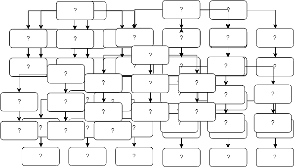
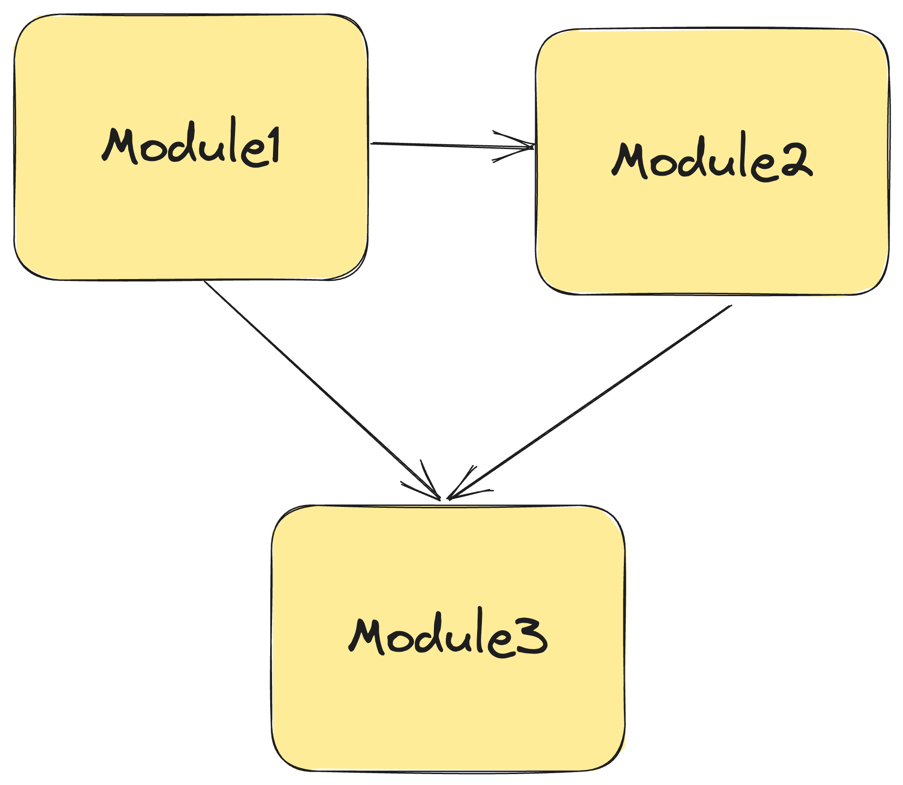
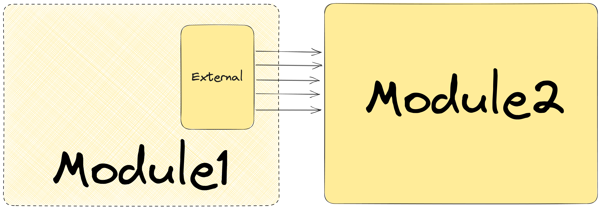
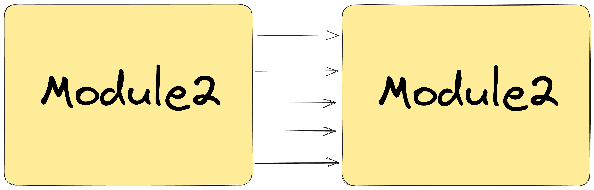
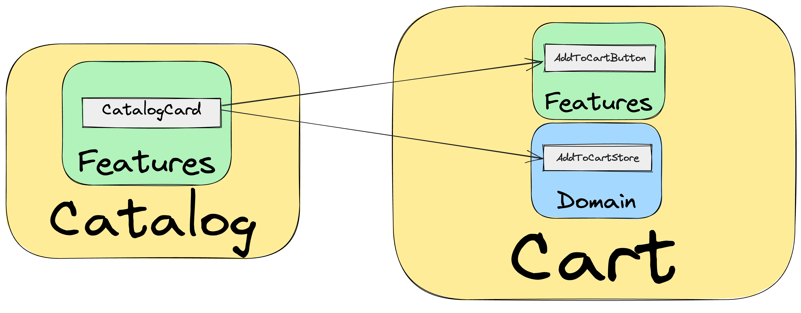

# Modules Overview


**Modules** **- the most important layer of the application.**

This layer contains the implementation of business requirements that make the product competitive. It is this layer that should receive the most attention during design and development.

## Motivation

To properly implement business requirements, it's necessary to consider the specifics of the project domain. It consists of a set of concepts, entities, and processes that are the foundation of development.

However, as the application functionality grows, the list of domain concepts can become too large and confusing. Concepts can become vague, and domain models complex and unmanageable. This leads to the application becoming like a "Big ball of mud".



To solve this problem, the architectural approach applies strategic design methods from DDD (Domain Driven Design).

## Dividing Domain into Modules

The large project domain is divided into subdomains (modules). Each subdomain contains its own isolated set of concepts.

Subdomains or modules are isolated sets of concepts that are connected to each other.

Advantages of using this method:

- Simplifies domain model perception, since each module contains only the concepts it needs. This also contributes to clearer understanding of business requirements and their implementation.
- Simplifies application scaling and improves its performance. If application functionality is distributed across modules, developers can work on each module independently, which speeds up the development process.
- Contributes to simplifying application testing and maintenance. If each module contains only the concepts it needs, testing each module becomes simpler and more effective.
- Allows distributing team responsibility zones and concept influence zones.

### Ubiquitous Language

For each module to be maximally understandable and consistent within the development team, it's important to use a ubiquitous language within each module. This means that each module should have its own dictionary of terms and concepts used within that module.

At the same time, identical terms in different modules can have different meanings. For example, in the error monitoring domain (Sentry), in the authorization and authentication module `User` will have one meaning and features, while in the error display module `User` will be the application user in which the error occurred.

Using ubiquitous language allows:

- Reducing the number of misunderstandings and errors during code development and maintenance.
- Improving communication between developers and other project participants, such as QA, project managers, and Backend.
- Avoiding double interpretation of concepts.

## Module Segmentation


A module contains two segments:

- **`Features`**. Features delivered by the module
- **`Domain`**.  Logic delivered by the module

Example structure:

```
├── app/
├── screens/
├── modules/
|    └── payment/
|    |    ├── features/
|    |    ├── domain/
|    |    └── index.ts
├── data/
└── shared/
```

### Features

[Detailed Features Overview](./features/overview.en.md)

### Domain

[Detailed Domain Overview](./domain.en.md)

## Module Dependencies

**Modules** depend on:

- Shared
- Data
- Other modules


Dependencies on Shared and Data don't need to be controlled, they can be freely used in **`Modules`**.

However, system modules can use each other's `features` and `domain`. It's important to control dependencies between modules and ensure that the coupling level is minimal.



**Low coupling level allows making changes to modules without significant impact on other modules.** This means that when changing logic in one module, other modules won't be affected. This also contributes to code reuse, as each module can be used in other projects or other parts of the current project.

To control dependencies between modules, the following concepts are used:

- Using `index` files to provide public API. Control of delivered features
- Using `external` files to control incoming dependencies



```
├── app/
├── screens/
├── modules/
|    ├── payment/
|    |    ├── features/
|    |    ├── domain/
|    |    ├── external.ts # Incoming dependencies
|    |    └── index.ts    # Module's public API
├── data/
└── shared/
```

### Using `index` files to provide public API

Each module should provide a public API: what features the module is ready to provide to the application.

To implement this approach, `index` files are used:

```
├── app/
├── screens/
├── modules/
|    ├── payment/
|    |    ├── features/
|    |    ├── domain/
|    |    └── index.ts # Module's public API
├── data/
└── shared/
```

`index.ts`

```tsx
export {
  CardPaymentStore,
  CashPaymentStore,
  type PaymentType,
} from './domain'

export { CardPayment, CashPayment } from './features'
```

In this example, the PaymentModule provides for use only what is exported from `index.ts`. Other `features` and `domain` are not available outside the module.

**Imports from a module should only go through `index`**

Valid:

```
import { CashPayment } from '@modules/payment';
```

Invalid:

```
import { PayButton } from '@modules/payment/features';
```

### Using `external` files to control incoming dependencies

It's necessary to control the coupling level between modules.

A situation may occur when one module is strongly coupled with another. Without an intermediate layer, this will lead to fragility of one of the modules - changing one module provokes changes in another.



To solve this problem, each module should explicitly describe its input dependencies on other modules through `external` files.


Thanks to `external`, we can effortlessly track module dependencies and, if necessary, get rid of unwanted coupling.

**Example**

`Payment` module uses `UserStore` from `Auth`.

```
├── app/
├── screens/
├── modules/
|    ├── auth/
|    ├── payment/
|    |    ├── features/
|    |    ├── domain/
|    |    ├── external.ts
|    |    └── index.ts
├── data/
└── shared/
```

`Payment` should import from `Auth` module only through the `external` file.

Valid

`external.ts`

```
export { UserStore } from '@modules/auth';
```

`Payment/features/card-payment/store/store.ts`

```
import { UserStore } from '../../../external';
...
```

Invalid

`Payment/features/card-payment/store/store.ts`

```
import { UserStore } from '@modules/auth';
...
```

## Universal Modules (Layout)

When designing modules, it's important to understand that there are universal subdomains that are not directly related to the project domain, but contain features from other modules.

An example of such an area could be `Layout`.

Application `Layout` can contain `header`, `footer`, `page-layout`, etc.

At first glance, these features don't belong to the project domain and should be placed in `shared`. But this is not the case. `Layout` can contain features from `AuthModule` inside to display user data on each screen. Thus `LayoutModule` becomes a universal module because it's indirectly related to the project domain.

```
├── app/
├── screens/
├── modules/
|    ├── layout/
|    |    ├── features/
|    |    |    ├── app-header/
|    |    |    ├── app-footer/
|    |    |    ├── app-layout/
|    |    |    ├── page-layout/
|    |    |    ├── form-layout/
|    |    |    └── index.ts
|    |    ├── domain/
|    |    └── index.ts
├── data/
└── shared/
```

When designing universal modules, it's important to define their boundaries and not load them with functionality that doesn't relate to their main purpose.

For example, the `NoAccess` feature doesn't belong to `Layout`, such a feature should be moved to `AccessModule`.

## Where to Start

At the beginning of design, it will be enough to identify two or three modules, one of which will be Layout.

As features grow in a module, you'll be able to understand that you need to separate a separate module for a set of features.

## Example of Online Store Module Design

Let's say we're developing an online store application.

#### Modules

The domain can be divided into the following modules:

- **Product Catalog** - contains everything related to the interaction between **product** and **buyer**. Module features may include searching products by various parameters, filtering products by categories and tags.
- **Cart** - responsible for managing the **buyer's** **cart**. Module features may include adding products to cart, changing product quantities, and placing orders.
- **Payment** - responsible for processing **payment** of **orders** in the application. Module features may include selecting payment method, entering payment card data, processing payments, and displaying payment status to the user.
- **Authorization and Registration** - responsible for user management. Module features may include registering new users, authorization, and user profile management.
- **Layout** - responsible for application block layout.

```
├── app/
├── screens/
├── modules/
|    ├── catalog/
|    ├── cart/
|    ├── payment/
|    ├── auth/
|    └── layout/
├── data/
└── shared/

```

#### Catalog Module

**Features**

```
├── app/
├── screens/
├── modules/
|    ├── catalog/
|    |    ├── features/
|    |    |    ├── catalog-list/   # Product list
|    |    |    ├── product-photo/  # Product photo. Is a private feature.
|    |    |    ├── catalog-card/   # Product card
|    |    |    ├── filters/       # Product filtering
|    |    |    ├── search-bar/     # Product search
|    |    |    └── index.ts
|    |    ├── domain/
|    |    └── index.ts
|    ├── cart/
|    ├── payment/
|    ├── auth/
|    ├── layout/
├── data/
└── shared/

```

**Feature Dependencies**

`CatalogCard` should contain a button for adding a product to cart. Adding a product to cart is the responsibility of the `Cart` module, which is where the add product button UI `AddToCartButton` and the business logic for adding a product `AddToCartStore` are located.

`AddToCartButton` and `AddToCartStore` are used in `CatalogCard.`



**Reusable ProductPhoto Feature**

`ProductPhoto` is reused in `CatalogList` and `CatalogCard`.

However, `ProductPhoto` is not exported from the `Catalog` module, which means it's not available in other modules.

#### Cart Module

```
├── app/
├── screens/
├── modules/
|    ├── catalog/
|    ├── cart/
|    |    ├── features/
|    |    |    ├── shopping-list/     # List of products added to cart
|    |    |    ├── order-form/        # Order form
|    |    |    ├── add-to-cart-button/  # Add to cart button
|    |    |    ├── cart-icon-btn/      # Cart icon with counter
|    |    |    └── index.ts
|    |    ├── domain/
|    |    |    ├── stores/
|    |    |    |    ├── add-to-cart-store/  # logic for adding product
|    |    |    |    └── index.ts
|    |    |    └── index.ts
|    |    └── index.ts
|    ├── payment/
|    ├── auth/
|    ├── layout/
├── data/
└── shared/
```

#### Payment Module

In the `payment` module we have the need to reuse card payment and cash payment logic, so this logic is moved to `domain`.

`CardPaymentStore` and `CashPaymentStore` are used inside `CardPayment`, `CashPayment` features, and can also be used in another module, for example, `Cart`.

```
├── app/
├── screens/
├── modules/
|    ├── catalog/
|    ├── cart/
|    ├── payment/
|    |    ├── features/
|    |    |    ├── payment-switch/    # Payment method selection
|    |    |    ├── card-payment/      # Card payment
|    |    |    ├── cash-payment/      # Cash payment
|    |    |    └── index.ts
|    |    ├── domain/
|    |    |    ├── stores/
|    |    |    |    ├── card-payment-store/  # Card payment logic
|    |    |    |    ├── cash-payment-store/  # Cash payment logic
|    |    |    |    └── index.ts
|    |    |    └── index.ts
|    |    └── index.ts
|    ├── auth/
|    ├── layout/
├── data/
└── shared/
```

#### Layout Module

Our layout for each page consists of: `header`, `footer`, `sidebar`.

In `header`, `CartIconBtn` from the `Cart` module is used to display the cart icon and product counter. At the same time, each `screen` will have its own `title` in the `header`.

We need to reuse `AppLayout` in `screens`, which will contain `CartIconBtn` and provide the ability to add its own `title` to `AppLayout` on each page.

This means that our `Layout` is connected to the project domain and therefore a separate module is allocated for `Layout`s.

```
├── app/
├── screens/
├── modules/
|    ├── catalog/
|    ├── cart/
|    ├── payment/
|    ├── auth/
|    ├── layout/
|    |    ├── features/
|    |    |    ├── app-layout/      # Application layout
|    |    |    ├── page-layout/     # Each page layout
|    |    |    ├── form-layout/     # Forms layout
|    |    |    └── index.ts
|    |    └── index.ts
├── data/
└── shared/
```

## Style Guide

[Modules | Style Guide](/style-guides/en/architecture/modules)
