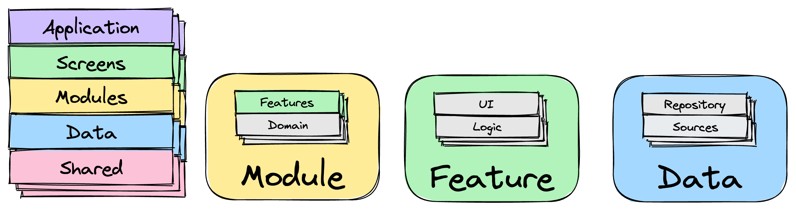
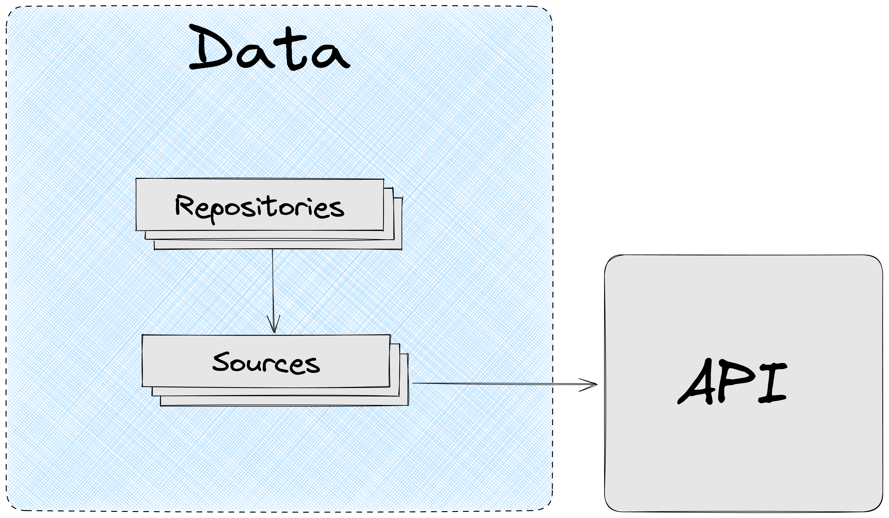
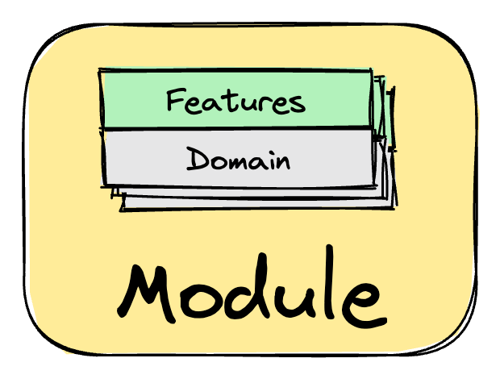
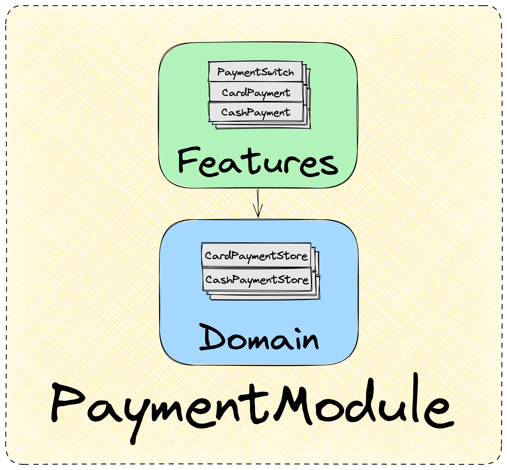
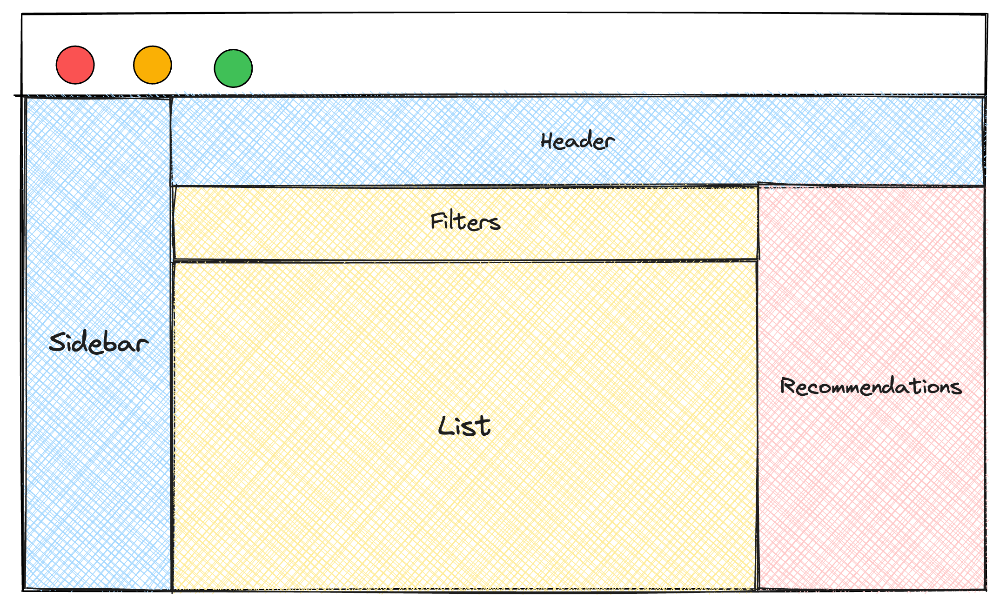

# Architecture Quick Overview

The architectural approach consists of architectural layers, some layers are divided into segments.



Dependencies between application layers/segments are directed top-down.

A lower layer/segment should know nothing about the upper one.

Example project structure:

```
├── app/
├── screens/
├── modules/
├── data/
└── shared/
```

## Shared. Independence from Low-Level Implementations and Libraries


The `Shared` layer contains reusable software entities that are not related to the project's domain.

`Shared` allows the application to be independent from low-level implementations, including libraries.

`Shared` can be considered as a layer that can be extracted into an npm package and used in other projects with different domains.

Example `Shared` structure for React stack:

```
├── app/
├── screens/
├── modules/
├── data/
└── shared/
|    ├── constants/
|    ├── types/
|    ├── utils/
|    ├── services/
|    ├── stores/
|    ├── ui/
|    |    ├── components/
|    |    ├── hooks/
|    |    ├── external.ts
|    |    └── index.ts
|    └── index.ts
```

## Data. Working with Application Data



The `Data` layer is responsible for working with data:

- Retrieving data from sources (server, localStorage…)
- Data aggregation and formatting
- Caching and cache modification
- Distributing DTO types throughout the application

`Data` allows:

- Protecting the application from API changes
- Decoupling from data source and retrieval method

`Data` contains two segments:

- `Repositories`. Facade providing data to the application.
- `Sources`. Services responsible for retrieving data from different sources. `Sources` can be auto-generated

```
├── app/
├── screens/
├── modules/
├── data/
|    ├── repositories/
|    ├── sources/
|    └── index.ts
└── shared/
```

### Sources

`Sources` - a segment with logic-free services, responsible only for retrieving data from various sources. The source can be anything: API, localStorage…

**Sources** don't handle data formatting, they simply extract it from the source and pass it to **Repository**.

### Repositories

`Repositories` are services used in **Modules** for working with data. Data in **Modules** is requested only through **Repositories**.

**Repositories** use `Sources` to retrieve data and further aggregate, format, and cache it.

### Contract First Development

The architectural approach provides a convenient tool for development when the API is not yet implemented, but contracts already exist (Contract First).

[Contract First Approach](./contract-first.en.md)

## Modules. Business Orientation



**Modules** **is the most important application layer. Modules should have high test coverage.**

This layer contains the implementation of business requirements that make the product competitive. This layer should receive the most attention during design and development.

For quality implementation of business requirements, it's necessary to consider the specifics of the project's domain.

In the architectural approach, the domain is divided into **subdomains** (modules), within which there are their own terms, entities, and business processes.

Thanks to modularity, the project can scale: a module can be assigned to another team for development or extracted into an independent microfrontend.

A module contains two segments:

- **`Features`**. Features provided by the module
- **`Domain`**. Pure business logic provided by the module

Example structure:

```
├── app/
├── screens/
├── modules/
|    └── payment/
|    |    ├── features/
|    |    ├── domain/
|    |    └── index.ts
├── data/
└── shared/
```

### Features. Application Features

Each module provides a set of features, the combination of which forms application screens (`screens`) or other features.

`Feature` is a ready-to-use component that solves its task.

Thanks to `Features`, any team member (even a non-developer) can easily and quickly determine what capabilities and functions this application provides, simply by looking at the directory names.



Example structure:

```
├── app/
├── screens/
├── modules/
|    └── payment/
|    |    ├── features/
|    |    |    ├── payment-switch/
|    |    |    ├── card-payment/
|    |    |    ├── cash-payment/
|    |    |    └── index.ts
|    |    ├── domain/
|    |    └── index.ts
├── data/
└── shared/
```

`Feature` contains everything necessary for operation:

- UI component **responsible only for rendering the feature.** No logic is implemented in the component
- Feature logic. **All feature logic, including UI logic, is implemented outside the UI component**
- Component styles
- Other UI components that are part of the main component
- Other software entities necessary for correct feature operation

The UI component should be responsible **only for display,** the amount of UI logic in the component should be reduced to zero**.**

All logic is implemented outside the component. Logic can be implemented on any preferred stack using:

- state manager
- hook (React stack)
- service

Separating the view layer from logic provides the following advantages:

- Ability to change logic and UI independently
- Easy reuse of logic or UI as needed
- Independence from the framework used. The framework can be replaced under certain circumstances, and logic can be reused
- Easy testing. Logic and UI can be tested separately
- Clear logic placement. All logic is always in one place
- Logic doesn't "spread" across components. Eliminates code maintenance complexity
- Improved code readability
- Simplified application maintenance and development

If domain logic is needed that is reusable between features or modules, it is placed in `Domain`.

### Domain. Pure Business Logic

`Domain` contains:

- Pure logic implementing business requirements
- Logic reusable between features or in other modules
- Data work, interaction with `Data`
- Types describing domain specifics
- Constants related to the domain

**If logic is not related to the project's domain, it should be moved to `shared`.**

Example structure:

```
├── app/
├── screens/
├── modules/
|    └── cart/
|    |    ├── features/
|    |    └── domain/
|    |    |    ├── services/
|    |    |    ├── stores/
|    |    |    |    ├── cart-store/
|    |    |    |    └── index.ts
|    |    |    ├── utils/
|    |    |    ├── types/
|    |    |    ├── constants/
|    |    |    └── index.ts
|    |    └── index.ts
├── data/
└── shared/
```

## Screens. Where Application Features Are Assembled



`Screens` are application screens.

Screens are assembled from `features` of different modules. This is also where `features` integration happens.

Screens are used in `Application` routing to bind to application routes and interact with the routing environment (e.g., query params).

Example structure:

```
├── app/
├── screens/
|    ├── feedback/
|    ├── no-access/
|    ├── not-found/
|    ├── popular-goods/
|    ├── new-goods/
|    |    ├── new-goods.tsx
|    |    ├── store/
|    |    └── index.ts
|    └── index.ts
├── modules/
├── data/
└── shared/
```

## Application. The Only Layer Dependent on Environment and Framework Specifics


The `Application` layer is the only layer that:

- Depends on the environment
  - Build tool specifics
  - Working with env
- Depends on the specifics of the framework used
- Depends on low-level implementations (used libraries)

The `Application` layer contains:

- Application routing
- Application and all services initialization/configuration

Example structure for React:

```
├── app/
|    ├── routing/
|    └── app.tsx
├── screens/
├── modules/
├── data/
└── shared/
```

Example structure for Next.js:

```
├── pages/          # pages is the application layer (Next.js specificity)
|    ├── index.tsx
|    ├── _app.tsx
├── screens/
├── modules/
├── data/
└── shared/
```

## Testing

Testing in the architectural approach is an important part of the designed system.

Tests should receive the same attention and quality focus as other significant code in the project.

The architectural approach describes testing principles that allow implementing important testing attributes:

- Bug protection
- Refactoring resistance - low fragility level
- Execution speed
- Easy maintenance
