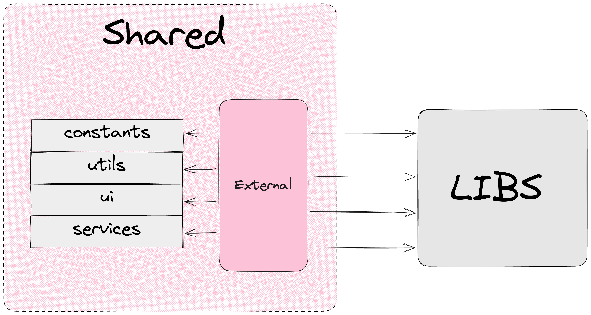

# Shared

## Main Concept



The `Shared` layer contains reusable software entities that are not related to the project's domain.

**Purpose of Shared**: protecting the application from low-level implementations, including libraries.

Shared can be considered as a layer that could be extracted into an npm package and used in other projects with different domains.

`Shared` can contain:

- constants common to the entire application but not related to the domain
- types
- utils
- services
- stores
- components
- hooks
- …

If a software entity is somehow related to the project's domain, it should be placed in `Modules`.

Example structure of `Shared` for React stack:

```
├── app/
├── screens/
├── modules/
├── data/
└── shared/
|    ├── constants/
|    ├── types/
|    ├── utils/
|    |    ├── format-date/
|    |    ├── external.ts
|    |    └── index.ts
|    ├── services/
|    ├── stores/
|    ├── ui/
|    └── index.ts
```

## Shared Availability

The Shared layer is available for use in all application layers.


## Independence from Libraries

`Shared` allows other layers to not depend on libraries by applying DI (dependency inversion) to them.

No other layer should directly import a library. There are exceptions for which dependency inversion is difficult to implement (for example, react).

In `Shared`, all external dependencies should be controlled through `external.ts` files. `external.ts` re-exports external dependencies.

```
├── app/
├── screens/
├── modules/
├── data/
└── shared/
|    ├── constants/
|    ├── types/
|    ├── utils/
|    |    ├── format-date/
|    |    ├── external.ts
|    |    └── index.ts
|    ├── services/
|    ├── stores/
|    ├── ui/
|    └── index.ts
```

Thanks to dependency re-exports in `shared`, we can replace one library or implementation with another without major problems, while not making changes to other application layers.

**Example 1**

The project uses `date-fns` for working with dates, and there's a need to migrate to `dayjs`.

Thanks to the fact that the application doesn't interact directly with `date-fns`, we can change the implementation of date methods in shared to use `dayjs`, while keeping the original method interfaces.

**Example 2**

The project uses `mui` as a UI library.

Customization of the `Button` component was required.

For customization, we need to make changes in `shared`, while no changes are needed in other application layers.

---

## Testing

Tests in `shared` follow unified requirements:

[Unit tests | Style Guide](/unit-testing/overview.en.md)

`Shared` is an infrastructure layer available in all application layers.

Therefore, in `shared`, all software entities containing logic should be covered by tests.

### UI Testing

If shared UI components contain logic, then the UI should be tested using an appropriate tool (for example, @testing-library/react).

This concept differs from `features` because `shared` doesn't contain business logic.

### Interaction with Libraries

**External library behavior should not be tested**. Reason: external libraries should already be tested, we should trust them if we use them.

**External libraries should not be mocked.** Exception: the library interacts with external data sources.

### Test Case Formation

[Unit tests | Style Guide](/unit-testing/test-case-formatting.en.md)
